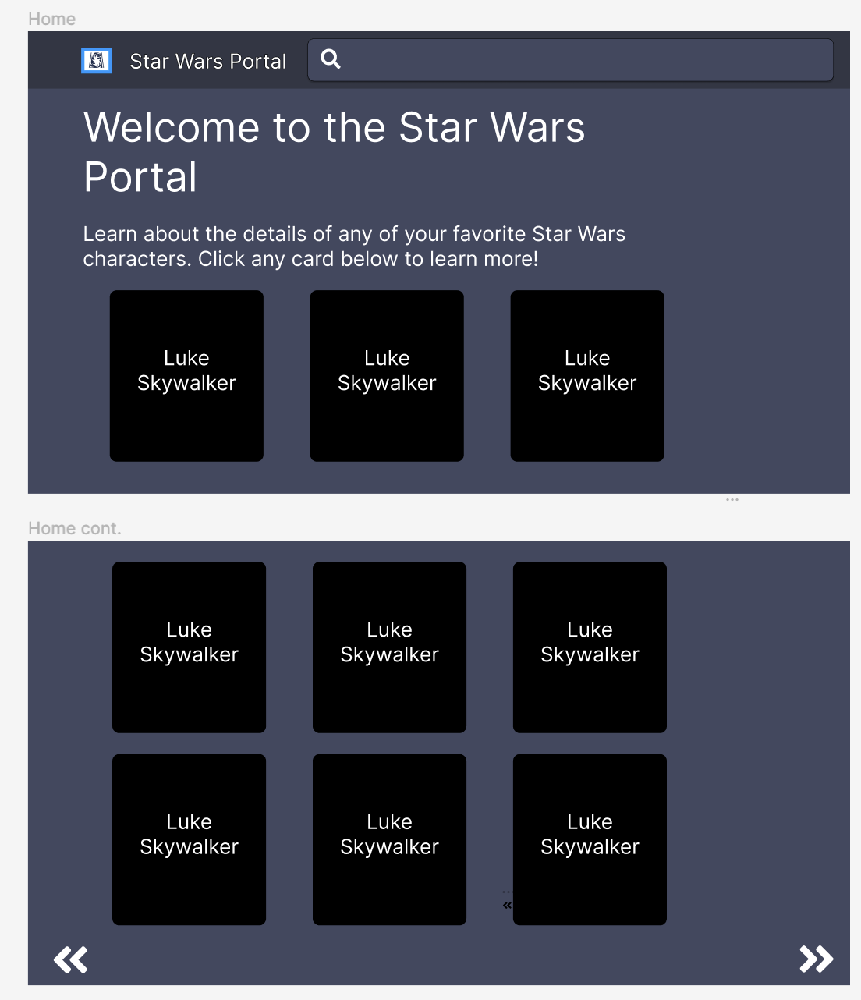
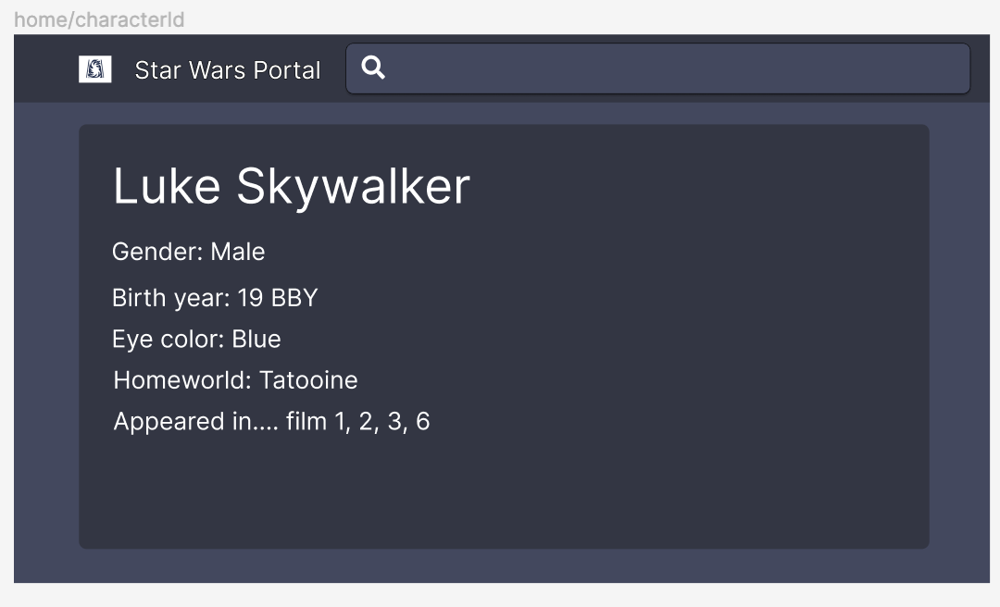
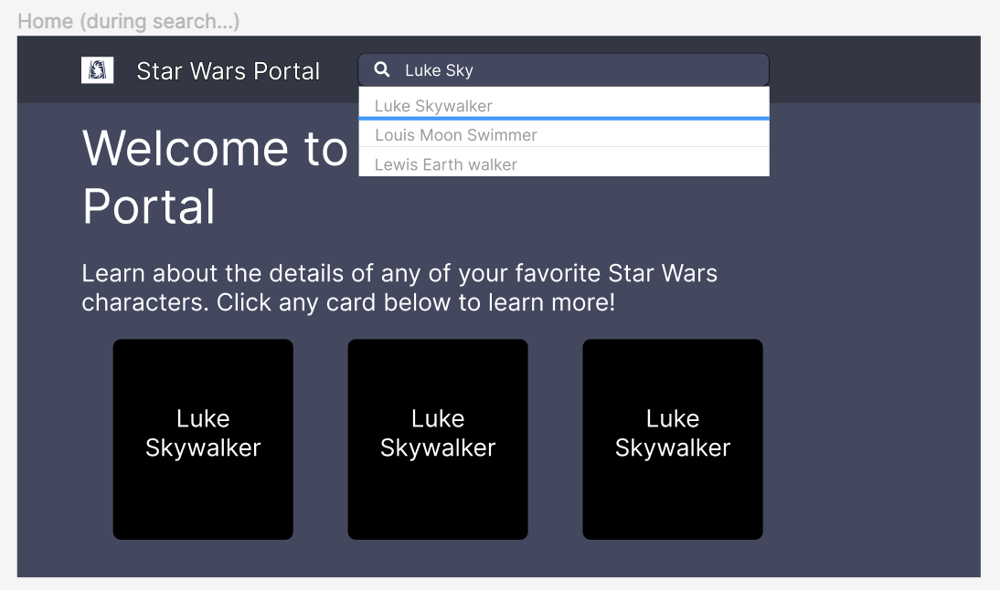

# TODO
[X] Let user search character by name
- [X] Store input field text in react state
- [X] On click of submit button (or Enter keypress), make a request to server to search for people with name
- [X] Once response is recieved, update the people context so that the star wars characters re-render

[X] Let users move to next (or previous) ten characters if enough results. Disable the right and left pointers if not enough results. 
- [X] Find icons for left and right pointers
- [X] On click of right pointer, grab the next pointer of the people context. Then update the people context with the next page.
- [X] On click of left pointer do the symmetric opposite of above.

[X] Add Grogu to our front-end application

[ ] Test util functions getResource/getResources by providing a SWAPI URL for a resource and matching against an expected output

[ ] Test GET route for /person/:name
- [ ] Should return a 400 error if :name of person does not exist (e.g. /person/asdf)
- [ ] Should return a 400 error if :name matches more than one person (e.g. /person/dar should match Darth Vader, Biggs Darklighter, Darth Maul)
- [ ] Should return a 200 if if a single :name perfectly matches (e.g. /person/Luke Skywalker)
- [ ] If response status is 200, it should ialso return an object with fields, name, gender, birthYear, homeworld and films
- [ ] Should return a 500 (internal server error) if URL is malformatted

[ ] Test GET route for /people
- [ ] /people 
    - [ ] should return status of 200 
    - [ ] should return content type header of json
    - [ ] /people should return a an object with count of 82
    - [ ] /people shoudl return 82 items in the results field
    - [ ] / people should have the correct previous and next references

## Wireframes
Below are three wireframes that I'll use (created myself using Figma) for prototyping the design of the home page, character page as well as the search feature. These wireframes will help me identify the necessary React components I need as well as think about the functionality in the backend needed to create each view.

## Wireframe for Home Page

## Wireframe for Character Page

## Wireframe for Search Feature
